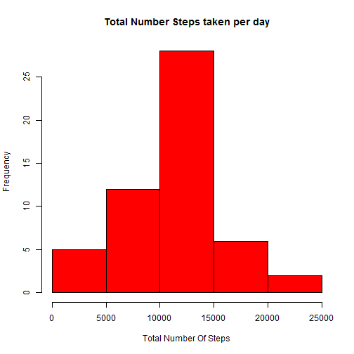
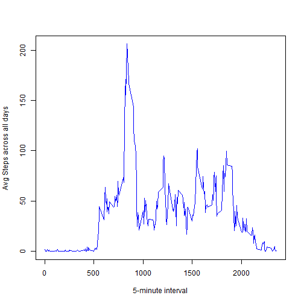
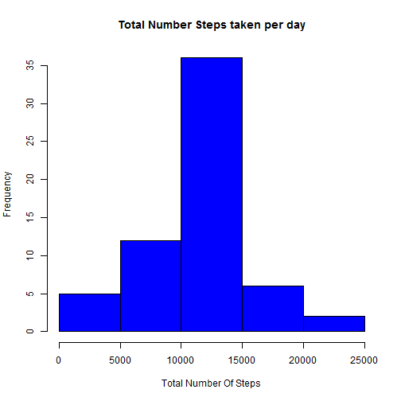

This is an R Markdown document representing Project1 

### Step Number 1- Setting the Global environment & Getting the Data 

```r
library(knitr)
opts_chunk$set(echo = TRUE) 
library (plyr)
library(dplyr) ## Loading the dplyr Package
setwd ("C:\\Users\\SA186014\\Documents\\GitHub\\RepData_PeerAssessment1\\") ## Setting the Path to the working directory
```
* Download the file into your R working Directy
* Unzip the file into the same Directory

### Step Number 2- Loading and preprocessing the data

```r
activity<-read.csv ("activity.csv") ## Reading the R 
cactivity<-activity [complete.cases(activity),] ## Creating a New Data Set without NAs
```

## Answering the questions
### What is mean total number of steps taken per day?
1.Make a histogram of the total number of steps taken each day

```r
by_day<- group_by(cactivity,date)
perday<- summarize(by_day, count=sum(steps))
hist(perday$count,col="red" , main ="Total Number Steps taken per day" ,xlab ="Total Number Of Steps")
```

 

2.Calculate and report the mean and median total number of steps taken per day

```r
mean1<- mean (perday$count)
median1 <- median (perday$count)
```

* The mean of the total number of steps taken per day is 1.0766189 &times; 10<sup>4</sup>
* The median of the total number of steps taken per day is 10765

### What is the average daily activity pattern?

```r
by_interval <- group_by (cactivity,interval)
perinterval<- summarize (by_interval, count=mean(steps))
maxinterval <- perinterval[which.max(perinterval$count),1]
plot (perinterval$interval,perinterval$count,type='l',xlab ="5-minute interval" ,ylab="Avg Steps across all days ", col='blue')
```

 

The 835 interval contains the maximum number of steps  on average across all the days in the dataset

### Imputing missing values
1. Calculating the total number of rows with NAs

```r
NArows <- nrow(activity)- nrow (cactivity)
```
The Total Number of rows with NA is 2304

2. In order to fill in the NA Values, we will calculate  the mean for that 5-minute interval across the data set and replace the NA with it


```r
impute.mean <- function(x) replace(x, is.na(x), mean(x, na.rm = TRUE))
nactivity <- ddply(activity, ~ interval, transform, steps = impute.mean(steps)) # new data set
```
3. The nactivity is the new data set
4. Using the new Dataset Histogram total number of steps each day 

```r
nby_day<- group_by(nactivity,date)
nperday<- summarize(nby_day, count=sum(steps))
hist(nperday$count,col="blue" , main ="Total Number Steps taken per day" ,xlab ="Total Number Of Steps")
```

 

```r
mean3<- mean (nperday$count)
median3 <- median (nperday$count)
```
* The new mean of the total number of steps taken per day is 1.0766189 &times; 10<sup>4</sup>
* The new median of the total number of steps taken per day is 1.0766189 &times; 10<sup>4</sup>
* The difference in means between the old and new dataset is 0
* The difference in medians between the old and new dataset is 1.1886792
* The impact of imputing missing data on the estimates of the total daily number of steps is that the mean & the median are identical

### Are there differences in activity patterns between weekdays and weekends?
1. Create a new factor variable in the dataset with two levels - "weekday" and "weekend" indicating whether a given date is a weekday or weekend day.

```r
nactivity$date = as.Date(nactivity$date)
dateweekdays = weekdays(nactivity$date)
dateweekend =  dateweekdays == "Sunday" | dateweekdays == "Saturday"
nactivity$day = factor(as.integer(dateweekend), levels=c(0, 1), labels=c("weekday", "weekend"))
```

2. Make a panel plot containing a time series plot of the 5-minute interval (x-axis) and the average number of steps taken, averaged across all weekday days or weekend days (y-axis). 

```r
library('lattice')
weekdata = aggregate(steps ~ interval + day, FUN="mean", data = nactivity)
xyplot(steps ~ interval | day, data = weekdata, xlab = 'Interval', ylab = 'Number of steps', type = 'l', layout=c(1, 2))
```

 
